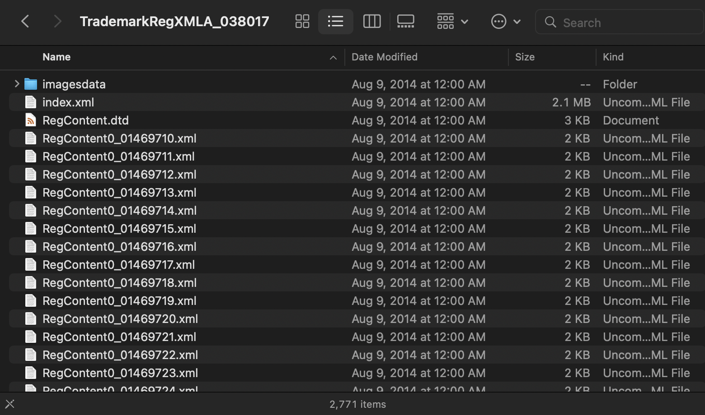
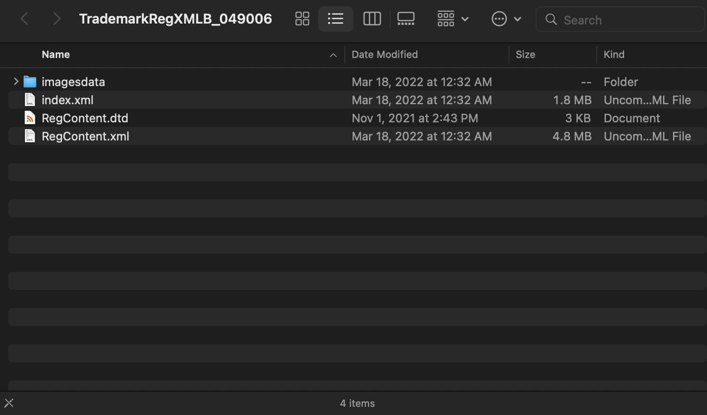

# I. Data Sources
- 智慧財產權 e 網通：[https://tiponet.tipo.gov.tw/030_OUT_V1/home.do](https://tiponet.tipo.gov.tw/030_OUT_V1/home.do)
  - 專利商標公開資料：[https://tiponet.tipo.gov.tw/Gazette/OpenData/OD/OD01.aspx](https://tiponet.tipo.gov.tw/Gazette/OpenData/OD/OD01.aspx)
    - `TrademarkXMLA` 商標公報／商標註冊案公報
      - [Document Type Definition (DTD)](https://tiponet.tipo.gov.tw/Gazette/OpenData/DownLoadFiles/DTD_Trademark.pdf)
      - 資料範圍：第 38 卷第 17 期（民國 100 年 9 月）至今
      - 資料量：22G
        |  |  |
        | :-: | :-: |
        | a. 商標公報（一案） | b. 商標公報（一卷期） |
    - `Tmarkappl` 商標權及關聯案件／商標申請案
      - [DTD](https://tiponet.tipo.gov.tw/Gazette/OpenData/DownLoadFiles/%E5%95%86%E6%A8%99%E6%AC%8A%E5%8F%8A%E9%97%9C%E8%81%AF%E6%A1%88DTD%E8%AA%AA%E6%98%8E%E6%96%87%E4%BB%B6.pdf)
      - 資料範圍：可能包含更早期的
      - 資料量：3G
      - `Issue` 載入檔案慢、無法載入
    - API 服務／商標註冊申請案
      - [DTD](https://tiponet.tipo.gov.tw/Gazette/OpenData/DownLoadFiles/%e5%95%86%e6%a8%99API%e8%aa%aa%e6%98%8e%e6%96%87%e4%bb%b6.pdf)
      - 資料同上
- 商標公報（網路公報）：[https://tiponet.tipo.gov.tw/Bulletin/trademark](https://tiponet.tipo.gov.tw/Bulletin/trademark)
- 商標檢索系統：[https://twtmsearch.tipo.gov.tw/OS0/OS0101.jsp](https://twtmsearch.tipo.gov.tw/OS0/OS0101.jsp)
- 智慧財產局商標主題網：[https://topic.tipo.gov.tw/trademarks-tw/mp-201.html](https://topic.tipo.gov.tw/trademarks-tw/mp-201.html)

# II. Data Retrieval
- For detailed information, visit https://tiponet.tipo.gov.tw/Gazette/OpenData/DownLoadFiles/FTP_Doc.pdf.
